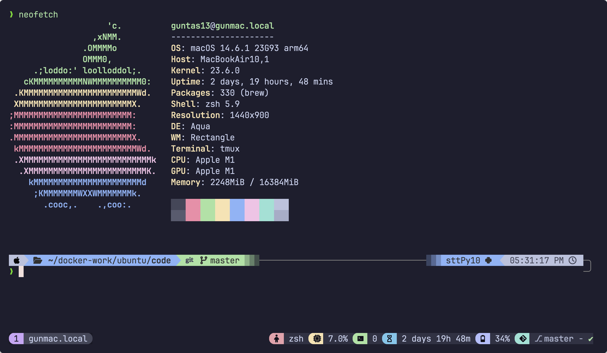
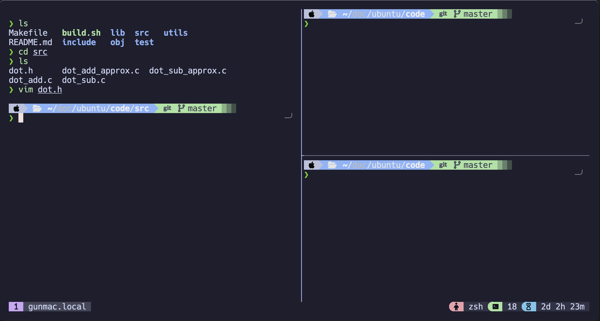
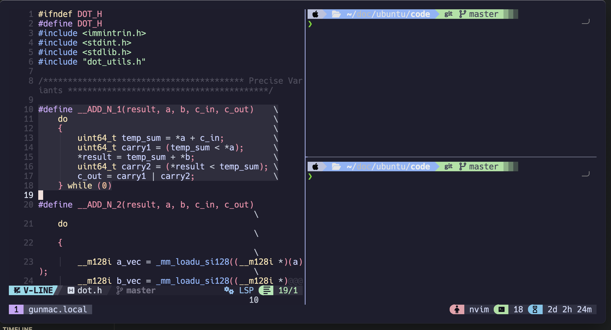
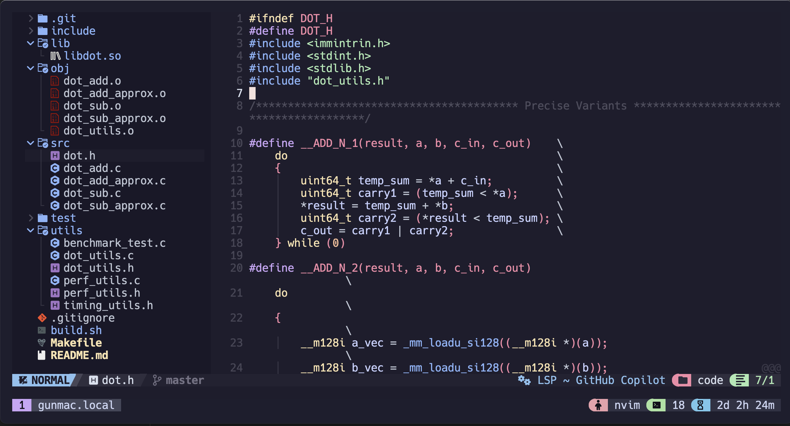
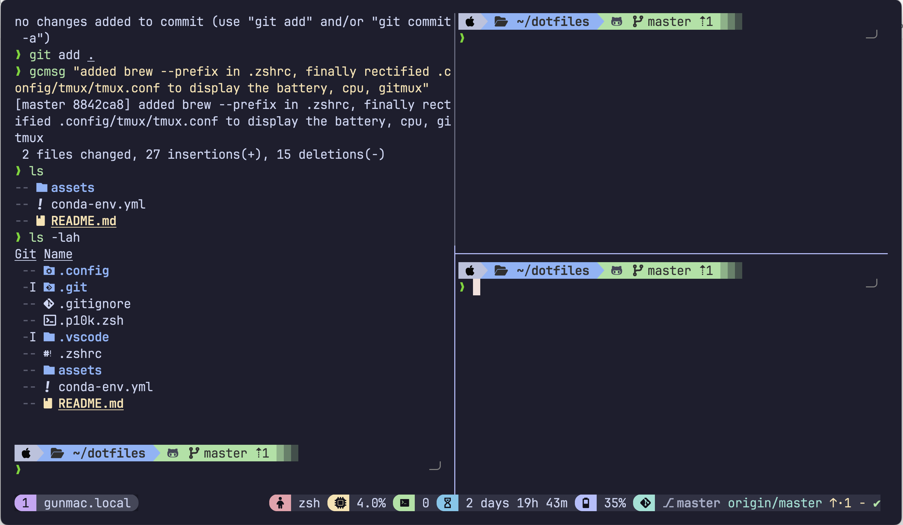
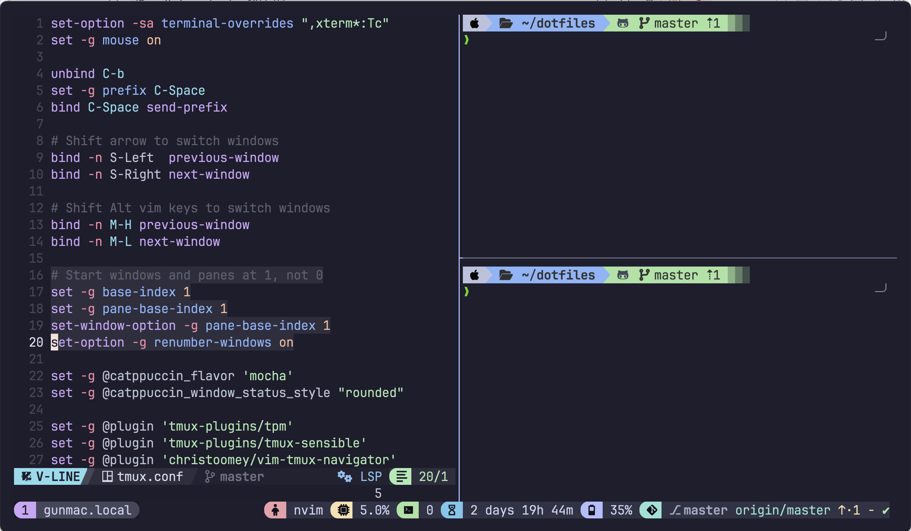
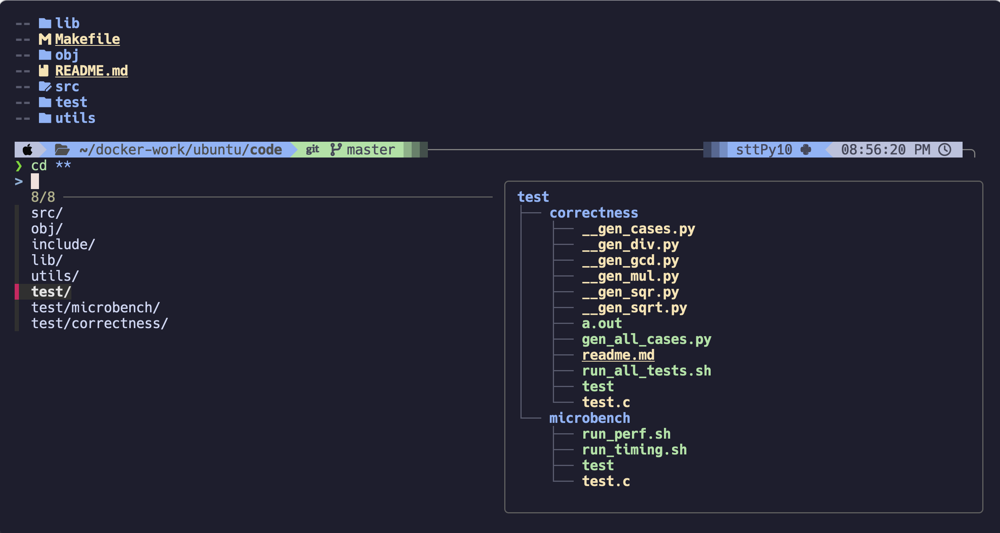
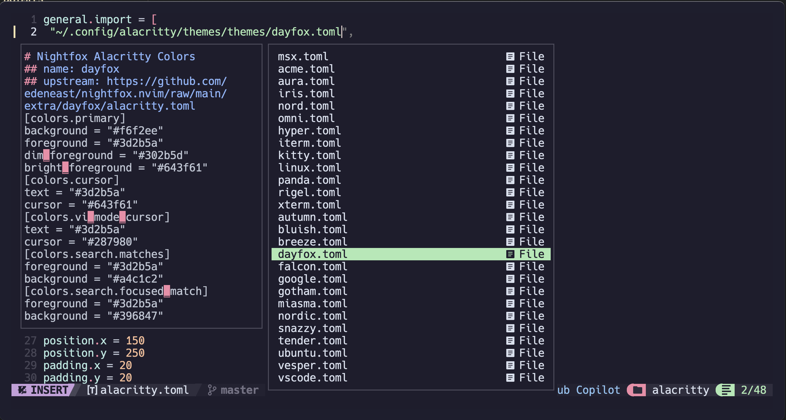

# dotfiles

My personal macOS dotfiles managed with **[GNU Stow](https://www.gnu.org/software/stow/)**. <br>
**[Zsh](https://ohmyz.sh/)** configuration with **[Powerlevel10k](https://github.com/romkatv/powerlevel10k)**. **[Neovim](https://neovim.io/)** configuration with **[NvChad](https://nvchad.com/)**. Terminal emulator configs for **[Alacritty](https://alacritty.org/)** & **[Ghostty](https://ghostty.org/)** as well as **[Tmux](https://github.com/tmux/tmux)** configuration managed using **[TPM](https://github.com/tmux-plugins/tpm)** (Tmux Plugin Manager) with **[Gitmux](https://github.com/arl/gitmux)** and **[Catppuccin Tmux](https://github.com/catppuccin/tmux)** (Catppuccin theme for Tmux).
Finally, a **[Miniconda](https://www.anaconda.com/docs/getting-started/miniconda/install)** setup for Python environment (`conda-env.yml`)

> [!NOTE] 
> * `$HOME` refers to the user's home directory: `/Users/your-username/` or `~`.
> * Most configurations are now looked in for in `XDG_CONFIG_HOME` following the [XDG Base Directory Specification](https://specifications.freedesktop.org/basedir-spec/basedir-spec-latest.html).
> * `XDG_CONFIG_HOME` defaults to `$HOME/.config/` in this configuration.
> * `$(brew prefix <package>)` returns the installation path of a Homebrew package (`/opt/homebrew/opt/<package>` on Mac).

## Quick Start

### Prerequisites

Install [Homebrew](https://brew.sh/):

```bash
/bin/bash -c "$(curl -fsSL https://raw.githubusercontent.com/Homebrew/install/HEAD/install.sh)"
```

### Required Packages

Install essential tools via Homebrew:

```bash
brew install git stow zsh neovim tmux fzf zoxide tree coreutils gnu-sed git-lfs osx-cpu-temp btop bat eza vim --override-system-vi
```

### Installation

1. **Clone the repository**

   ```bash
   git clone https://github.com/guntas-13/dotfiles.git $HOME/dotfiles
   cd $HOME/dotfiles
   ```

2. **Set Zsh as the default shell**

   ```bash
   chsh -s $(which zsh)
   ```

   Restart your terminal for the changes to take effect.

3. **Install Oh My Zsh**

   Install Oh My Zsh using the official installation script:

   ```bash
   sh -c "$(curl -fsSL https://raw.githubusercontent.com/ohmyzsh/ohmyzsh/master/tools/install.sh)"
   ```

   When prompted, allow Oh My Zsh to set up the default configuration. You'll overwrite it in the next step.

4. **Deploy dotfiles with Stow**

   ```bash
   cd $HOME/dotfiles
   stow --adopt .
   ```

   After running `stow --adopt .`, the following symlinks will be created:

   ```
   ~/.zshrc           -> ~/dotfiles/.zshrc
   ~/.p10k.zsh       -> ~/dotfiles/.p10k.zsh
   ~/.config/nvim/    -> ~/dotfiles/.config/nvim/
   ~/.config/alacritty/ -> ~/dotfiles/.config/alacritty/
   ~/.config/tmux/    -> ~/dotfiles/.config/tmux/
   ~/.config/ghostty/  -> ~/dotfiles/.config/ghostty/
   ```

5. **Download Nerd Fonts**

   Download and install a Nerd Font from the [Nerd Fonts repository](https://github.com/ryanoasis/nerd-fonts) or their [website](https://www.nerdfonts.com/font-downloads) or use Homebrew:

   ```bash
   brew install --cask font-<FONT NAME>-nerd-font
   ```

6. **Download Alacritty and/or Ghostty**

   Visit [Alacritty](https://alacritty.org/) and/or [Ghostty](https://ghostty.org/) to download and install the latest release for macOS.

   ```bash
    brew install --cask alacritty ghostty
   ```

7. **Set up Conda environment**

   Download & Install from miniconda [website](https://www.anaconda.com/docs/getting-started/miniconda/install) or use the following commands:

   ```bash
   # Download and install Miniconda
   curl -O https://repo.anaconda.com/miniconda/Miniconda3-latest-MacOSX-arm64.sh
   bash Miniconda3-latest-MacOSX-arm64.sh
   ```

   Initialize conda (if not done during installation):

   ```bash
   conda init zsh
   ```

   Restart your terminal, then load the conda environment:

   ```bash
   cd $HOME/dotfiles
   conda env create -f conda-env.yml
   conda activate sttPy10
   ```

   To update the `conda-env.yml` file after installing new packages, run:

   ```bash
   conda env export --no-builds > $HOME/dotfiles/conda-env.yml
   ```

> [!IMPORTANT]
> **Remove the below block from `.zshrc` file**. _This block was automatically added during past conda initialization and a new block will be appended during the above installation steps._
>
> <details>
> <summary> <b>Remove this block!</b> </summary>
>
> ```bash
>   # >>> conda initialize >>>
>   # !! Contents within this block are managed by 'conda init' !!
>   __conda_setup="$('/Users/guntas13/micromamba/bin/conda' 'shell.zsh' 'hook' 2> /dev/null)"
>   if [ $? -eq 0 ]; then
>      eval "$__conda_setup"
>   else
>      if [ -f "/Users/guntas13/micromamba/etc/profile.d/conda.sh" ]; then
>         . "/Users/guntas13/micromamba/etc/profile.d/conda.sh"
>      else
>         export PATH="/Users/guntas13/micromamba/bin:$PATH"
>      fi
>   fi
>   unset __conda_setup
> # <<< conda initialize <<<
> ```

</details>

---

8. **Install Tmux Plugin Manager (TPM)**

   Follow instructions from the [TPM repository](https://github.com/tmux-plugins/tpm):

   ```bash
   git clone https://github.com/tmux-plugins/tpm ~/.config/tmux/plugins/tpm
   ```

9. **Install Gitmux**
   Follow instructions from the [Gitmux repository](https://github.com/arl/gitmux).

   ```bash
   brew install gitmux
   ```

   Save the default configuration to a new file:

   ```bash
   gitmux -printcfg > $HOME/.gitmux.conf
   ```

10. **Configure [Powerlevel10k](https://github.com/romkatv/powerlevel10k)**

   ```bash
   p10k configure
   ```

11. **Tmux Install Packages**

   ```bash
   # Start a new Tmux session
   tmux
   ```

   ```bash
   tmux source ~/.config/tmux/tmux.conf
   ```

> [!NOTE]
> * `prefix` is overwritten to `Ctrl + Space` in this configuration. Inside a Tmux session, press `prefix` + `I` (capital i) to install Tmux plugins.
> * `Ctrl-Space + v` to open a vertical split, `Ctrl-Space + h` to open a horizontal split.
> * `Ctrl + <hjkl>` to switch between panes like vim.
> * In NeoChad, `Space` is the leader key. `Space + t h` for theme panel, `Ctrl + n` or `Space + e` to open file explorer.

---

## Preview of the Configuration


















## Resources

### Tools & Package Managers

- [Homebrew](https://brew.sh/) - Package manager for macOS
- [GNU Stow](https://www.gnu.org/software/stow/) - Symlink farm manager

### Shell & Terminal

- [Oh My Zsh](https://ohmyz.sh/) - Zsh configuration framework
- [Powerlevel10k](https://github.com/romkatv/powerlevel10k) - Zsh theme
- [Alacritty](https://alacritty.org/) - GPU-accelerated terminal emulator
- [Ghostty](https://ghostty.org/) - Another terminal emulator
- [Zsh Plugins](https://github.com/ohmyzsh/ohmyzsh/tree/master/plugins) - Useful Zsh plugins for enhanced functionality
- [Nerd Fonts](https://github.com/ryanoasis/nerd-fonts) - Font patches for Powerlevel10k and Neovim

### Editors & Multiplexers

- [Neovim](https://neovim.io/) - Hyperextensible Vim-based text editor
- [NvChad](https://nvchad.com/) - Blazing fast Neovim config
- [Tmux](https://github.com/tmux/tmux) - Terminal multiplexer
- [TPM](https://github.com/tmux-plugins/tpm) - Tmux Plugin Manager
- [Catppuccin Theme](https://github.com/catppuccin/tmux) - A soothing pastel theme for Tmux
- [Gitmux](https://github.com/arl/gitmux) - Git repository status in Tmux status bar
- [TMux Cheat Sheet](https://tmuxcheatsheet.com/) - Handy reference for Tmux commands
- [Vim Cheat Sheet](https://vim.rtorr.com/) - Handy reference for Vim commands

Thanks to the YouTube Channels: **[Dreams of Anatomy](https://www.youtube.com/@dreamsofautonomy)** and **[Dreams of Code](https://www.youtube.com/@dreamsofcode)**. Check out these vidoes:

### This Zsh config is perhaps my favorite one yet.

<div align="left">
  <a href="https://www.youtube.com/watch?v=ud7YxC33Z3w"></a>
</div>

### Turn VIM into a full featured IDE with only one command

<div align="left">
  <a href="https://www.youtube.com/watch?v=Mtgo-nP_r8Y"></a>
</div>

### Tmux has forever changed the way I write code.

<div align="left">
  <a href="https://www.youtube.com/watch?v=DzNmUNvnB04"></a>
</div>

### Stow has forever changed the way I manage my dotfiles

<div align="left">
  <a href="https://www.youtube.com/watch?v=y6XCebnB9gs"></a>
</div>
